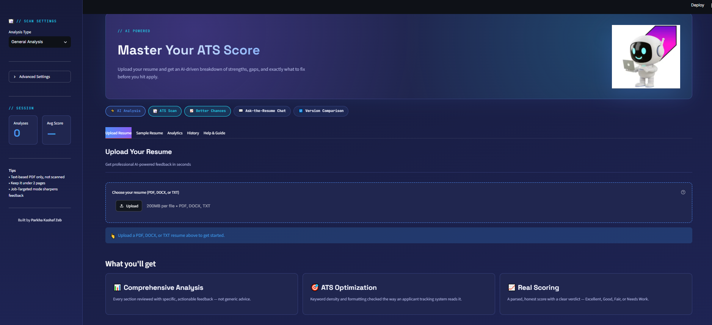
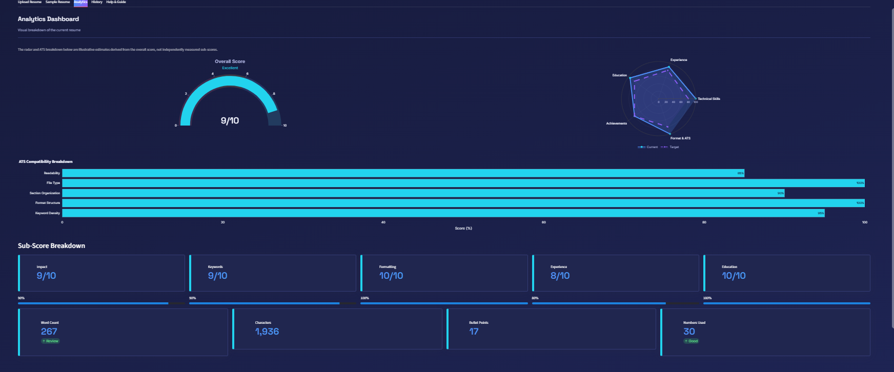
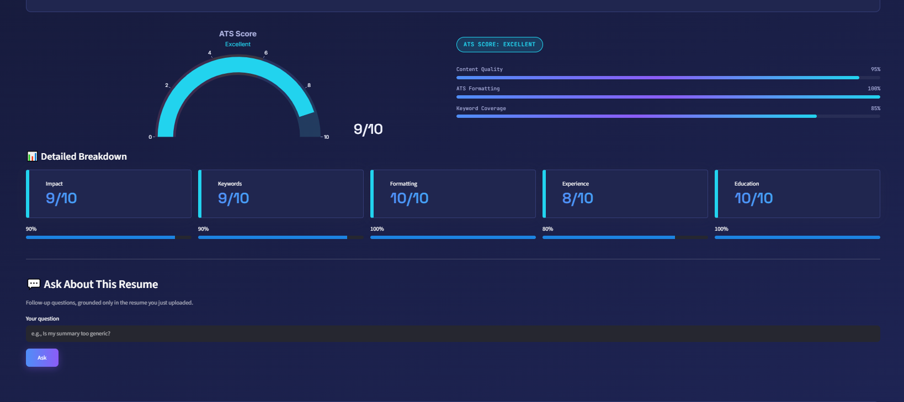
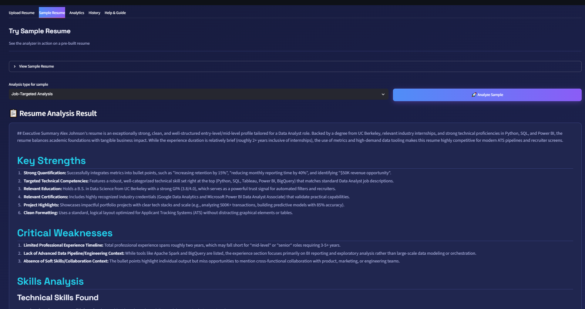
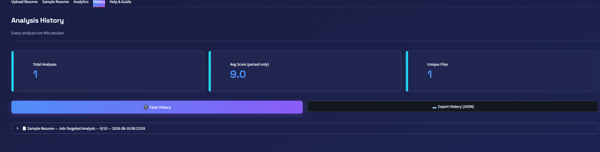

# 🤖 AI Resume Analyzer

An AI-powered resume analysis tool designed to provide professional feedback, identify resume weaknesses, and suggest actionable improvements using the Google Gemini API.

---

## 📌 Project Overview

The **AI Resume Analyzer** uses a Large Language Model (LLM) to evaluate resume content and provide feedback such as:

- Overall resume impression
- Key candidate strengths
- Weak or missing information
- Skills identified in the resume
- Specific and actionable improvements
- ATS-friendly recommendations

This project is part of my AI learning journey and demonstrates practical experience with:

- LLM API integration
- Prompt engineering
- Secure API-key management
- Python application development
- Git and GitHub
- AI application deployment

---

## 📸 Screenshots

### Main Interface


### Resume Analysis Result



### Skills Gap Analysis



### History


---

## 🛠️ Technology Stack

| Category              | Technology                          |
|-----------------------|-------------------------------------|
| Programming language  | Python 3.12                         |
| AI model              | Google Gemini 2.5 Flash             |
| SDK                   | `google-genai`                      |
| Web interface         | Streamlit                           |
| PDF processing        | `pdfplumber`                        |
| DOCX processing       | `python-docx`                       |
| PDF generation        | `reportlab`                         |
| Data visualization    | `matplotlib` / `plotly`             |
| Environment variables | `python-dotenv`                     |
| Version control       | Git and GitHub                      |

---

## ✨ Current Features

- [x] Gemini API integration
- [x] Command-line resume analysis
- [x] Streamlit prompt playground
- [x] Multiple prompt-engineering techniques
- [x] Structured resume feedback
- [x] Identification of strengths and weaknesses
- [x] ATS-friendly recommendations
- [x] Secure API-key management using `.env`
- [x] Fictional sample resume for safe testing
- [x] Multi-format upload (**PDF, DOCX, TXT**)
- [x] PDF text extraction using `pdfplumber`
- [x] Multi-format report download (**PDF, DOCX, TXT**)
- [x] Analytics scoring with visual graphs
- [x] Job-targeted analysis
- [x] Skills-gap analysis
- [x] Streamlit web application
- [x] Token usage tracking
- [ ] Structured JSON response
- [ ] Cloud deployment

---

## 📅 Development Progress

### ✅ Day 1 — Project Setup

- Created the initial project structure
- Created a Python virtual environment
- Initialized the Git repository
- Configured `.gitignore`
- Added secure environment-variable management
- Created the initial project documentation
- Pushed the first commit to GitHub

### ✅ Day 2 — Gemini API Integration

- Migrated to the current `google-genai` SDK
- Connected the application to the Gemini API
- Created a working command-line resume analyzer
- Added a fictional sample resume for testing
- Learned how LLM API requests and responses work
- Learned about tokens, context windows, and output-token limits
- Experimented with temperature and output length
- Protected the Gemini API key using `.env`
- Added API error handling

### ✅ Day 3 — Prompt Engineering Experiments

**Achievements:**
- Built an interactive **Streamlit Prompt Playground**
- Implemented **three prompt-engineering techniques**:
  - Zero-shot prompting
  - Role + Structured prompting
  - Few-shot prompting
- Added editable prompt area for custom experimentation
- Added token usage tracking
- Ran controlled experiments comparing all three techniques
- Documented findings in `prompt_experiments.md`
- Selected **Role + Structured Prompting** as the winning technique

**Experiment Results:**

| Technique | Format Quality | Content Quality | Tokens Used | Verdict |
|---|---|---|---|---|
| Zero-shot | Moderate | Inconsistent | 993 | Fast but unreliable |
| Role + Structured | Excellent | Excellent | 1,205 | ⭐ **Winner** |
| Few-shot | Perfect | Less detailed | 812 | Consistent but shallow |

**Key Finding:** Adding a professional role ("You are an expert recruiter...") combined with structured output requirements produced the most detailed, honest, and actionable feedback. Structure alone (Few-shot) was not enough — content quality matters more.

### ✅ Day 4 — PDF Upload and Real Resume Analysis

**Achievements:**
- Built a **production-ready Streamlit application** (`resume_analyzer.py`)
- Integrated **PDF file upload** using `st.file_uploader`
- Implemented **PDF text extraction** using `pdfplumber`
- Applied **Role + Structured prompting** (Day 3 winner) for analysis
- Added **automatic retry logic** for temporary API errors (503, 429)
- Implemented **error handling** for invalid or scanned PDFs
- Added **token usage metrics** display
- Created **professional UI** with sidebar, file details, and celebration animations

### ✅ Day 5 — Feature Completion, Multi-Format Support & Analytics

**Achievements:**
- Added support for uploading **PDF, DOCX, and TXT** resume formats
- Added support for downloading analysis reports in **PDF, DOCX, and TXT** formats
- Implemented **analytics scoring** with visual graphs and charts
- Added **job-targeted resume analysis**
- Added **skills-gap analysis** based on job description
- Improved overall UI with professional styling and better user experience
- Added session-state result preservation
- Enhanced error handling and user feedback

**Key Features Added:**
- Multi-format file support (upload & download)
- Visual analytics and scoring
- Skills gap visualization
- Job-specific recommendations

### 🔜 Day 6 — Deployment (Coming Next)

Planned tasks:

- Add Groq as backup API
- Deploy to Streamlit Community Cloud
- Make the application publicly accessible

---

## 🧠 How the Current Version Works

```text
User uploads resume (PDF / DOCX / TXT)
                  ↓
        Text extraction (pdfplumber / python-docx)
                  ↓
   Text sent to Gemini with Role + Structured prompt
                  ↓
     Gemini 3.5 Flash Lite generates analysis
                  ↓
   Formatted results + analytics displayed in web UI
                  ↓
        Report can be downloaded (PDF / DOCX / TXT)
he application accepts resumes in multiple formats (PDF, DOCX, TXT), extracts text automatically, sends it to Gemini using the Role + Structured prompt technique (proven best in Day 3 experiments), and displays comprehensive analysis with analytics scoring and visual graphs in a professional web interface.

---

## 📋 Current Analysis Sections

The application generates feedback in these sections:

1. **Overall Impression**
2. **Key Strengths**
3. **Weak or Missing Information**
4. **Skills Identified**
5. **Recommended Improvements**
6. **ATS-Friendly Suggestions**
7. **Analytics Score & Graphs**


---

## 📁 Project Structure

```text
AI-Resume-Analyzer/
│
├── .venv/                        # Local virtual environment
├── .env                          # Private Gemini API key
├── .env.example                  # Safe environment-variable template
├── .gitignore                    # Files excluded from Git
├── day2_llm_test.py              # Day 2: Command-line prototype
├── prompt_playground.py          # Day 3: Streamlit prompt playground
├── prompt_experiments.md         # Day 3: Experiment results & findings
├── resume_analyzer.py            # Day 5: Main application
├── day1_notes.md                 # Day 1 learning notes
├── day2_notes.md                 # Day 2 learning notes
├── day5_notes.md                 # Day 5 learning notes
├── requirements.txt              # Python dependencies
└── README.md                     # Project documentation
```


> `.venv/` and `.env` are stored locally and are not uploaded to GitHub.

---

## 🚀 How to Run the Project

### 1. Clone the repository

```bash
git clone https://github.com/pkashafzeb-cpu/AI-Resume-Analyzer.git
cd AI-Resume-Analyzer
```

### 2. Create a virtual environment

```bash
py -m venv .venv
```

### 3. Activate the environment

#### Windows PowerShell

```powershell
.\.venv\Scripts\Activate.ps1
```

#### Windows Command Prompt

```cmd
.venv\Scripts\activate.bat
```

### 4. Install the dependencies

```bash
python -m pip install -r requirements.txt
```

### 5. Configure the Gemini API key

Create a `.env` file in the project root:

```env
GEMINI_API_KEY=your_api_key_here
GEMINI_MODEL=gemini-3.5-flash-lite
```

Get your free API key at: [Google AI Studio](https://aistudio.google.com/apikey)

### 6. Run the Resume Analyzer (Main Application)

```bash
streamlit run resume_analyzer.py
```
Your browser will automatically open at `http://localhost:8501`

---

## 🧪 Prompt Engineering Techniques

### 1. Zero-Shot Prompting

Asks the AI to perform a task without any examples or specific role.

**Pros:** Fast, simple, low token usage on input  
**Cons:** Inconsistent quality, generic outputs, unreliable structure

**Best for:** Quick prototypes and casual queries

### 2. Role + Structured Prompting ⭐

Assigns the AI a specific expert role AND specifies exact output structure.

**Pros:** Detailed feedback, professional tone, actionable advice, honest assessment  
**Cons:** Uses more output tokens

**Best for:** Production applications where quality matters

### 3. Few-Shot Prompting

Provides an example of the ideal output before asking the AI to analyze.

**Pros:** Extremely consistent format, follows exact structure  
**Cons:** Less detailed content, higher input token cost

**Best for:** Batch processing where format consistency is critical

---

## ⚙️ Generation Parameters

The application uses two important LLM parameters:

### Temperature

Temperature controls how varied or predictable the generated response is.

| Temperature | Typical behavior |
|---:|---|
| `0.2` | More focused and consistent |
| `0.7` | Balanced variation (recommended) |
| `1.0` | More varied output |

Resume analysis generally benefits from focused and consistent output. The current default is `0.7`.

### Maximum Output Tokens

The maximum output-token setting limits how long the generated response can be.

| Token limit | Typical result |
|---:|---|
| `300` | Short response; sections may be incomplete |
| `700` | Moderate amount of feedback |
| `1000` | Detailed resume analysis |
| `1500` | Comprehensive analysis (recommended) |
| `2000+` | Extensive response with examples |

---

## 🔐 Privacy and Security

This project follows the following security practices:

- The Gemini API key is stored inside `.env`
- `.env` is excluded from Git using `.gitignore`
- The API key is never written directly into the Python code
- Only fictional or anonymized resumes are used during development
- Private resumes are not stored in the repository
- The virtual environment is not uploaded to GitHub

> Never upload your `.env` file, API key, or private resume data to GitHub.

---

## 🗺️ Project Roadmap

### ✅ Phase 1 — Foundation (Complete)

- [x] Set up the Python project
- [x] Configure Git and GitHub
- [x] Integrate the Gemini API
- [x] Build a command-line prototype

### ✅ Phase 2 — Prompt Engineering (Complete)

- [x] Build interactive Streamlit playground
- [x] Compare zero-shot, role-structured, and few-shot prompts
- [x] Improve system instructions
- [x] Add prompt constraints
- [x] Document experimental findings
- [x] Select optimal prompt technique
- [X] Add structured JSON output
- [X] Validate the generated response

### ✅ Phase 3 — Resume Processing (Complete)

- [x] Add multi-format upload (PDF, DOCX, TXT)
- [x] Extract text using pdfplumber and python-docx
- [x] Clean extracted resume text
- [x] Handle invalid or scanned PDF files
- [x] Add file details and size display

### ✅ Phase 4 — Advanced Analysis (In Progress)

- [X] Add analytics scoring and visual graphs
- [X] Add job-targeted analysis and skills-gap analysis
- [X] Compare a resume with a job description
- [X] Identify skills gaps
- [X] Generate role-specific recommendations

### 🔜 Phase 5 — Product and Deployment

- [x] Build a Streamlit interface
- [X] Add a downloadable PDF report
- [ ] Add Groq as backup API
- [ ] Improve error handling
- [ ] Add screenshots and an architecture diagram
- [ ] Deploy the application to Streamlit Community Cloud

---

## ⚠️ Current Limitations

- Scanned or image-based PDFs may not extract properly (text-based PDFs work best)
- ATS scoring is visual but not yet calculated as a numeric score
- The analysis depends on the quality of the supplied resume text
- LLM feedback should be treated as guidance, not a hiring decision
- Not yet deployed publicly (planned for Day 6)
---

## 🎯 Learning Outcomes

Through this project, I am learning how to:

- Build applications powered by LLM APIs
- Design and evaluate prompts through controlled experimentation
- Compare different prompt engineering techniques scientifically
- Protect API keys and sensitive information
- Handle temporary API errors and rate limits
- Extract and process PDF documents in Python
- Build interactive web applications with Streamlit
- Implement analytics scoring and data visualization
- Organize a professional Python repository
- Document project progress and findings
- Convert an AI prototype into a deployable application

---

## 👩‍💻 Author

**Parkha Kashaf Zeb**

Data Science student focused on building practical applications using:

- Python
- Machine Learning
- Data Analytics
- Large Language Models
- Retrieval-Augmented Generation
- AI Agents

---

## 📄 Disclaimer

This application is an educational project. Its feedback should be reviewed by the user and should not replace professional career advice or human resume evaluation.